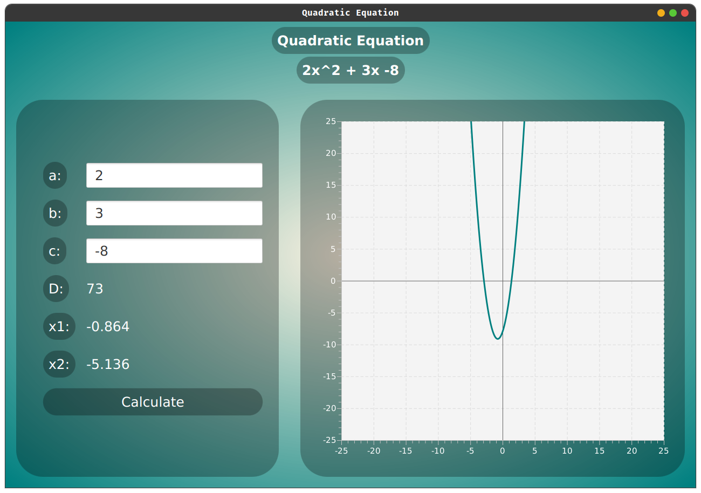

# A simple quadratic equation GUI app
This app can be used to enter 
- a
- b
- c

values into input fields, click "calculate" and then roots x1, x2 with discriminant D will be calculated. 
## Function graph
This app also renders a quadratic function (also a linear) graph for entered values, it is also scrollable.

## To run
### compile it using
> javac App.java
### run it using
> java App.java

## Requirements
- JDK (java development kit)
- JFX libraries (javafx libraries)
